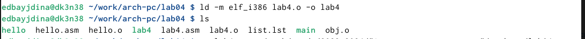
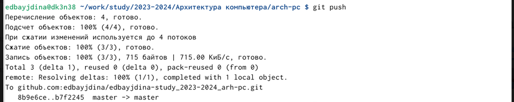

---
## Front matter
title: "Отчёт по лабораторной работе №4"
subtitle: "дисциплина: Архитектура компьютера"
author: "Байдина Елизавета Дмитриевна"

## Generic otions
lang: ru-RU
toc-title: "Содержание"

## Bibliography
bibliography: bib/cite.bib
csl: pandoc/csl/gost-r-7-0-5-2008-numeric.csl

## Pdf output format
toc: true # Table of contents
toc-depth: 2
lof: true # List of figures
lot: true # List of tables
fontsize: 12pt
linestretch: 1.5
papersize: a4
documentclass: scrreprt
## I18n polyglossia
polyglossia-lang:
  name: russian
  options:
	- spelling=modern
	- babelshorthands=true
polyglossia-otherlangs:
  name: english
## I18n babel
babel-lang: russian
babel-otherlangs: english
## Fonts
mainfont: IBM Plex Serif
romanfont: IBM Plex Serif
sansfont: IBM Plex Sans
monofont: IBM Plex Mono
mathfont: STIX Two Math
mainfontoptions: Ligatures=Common,Ligatures=TeX,Scale=0.94
romanfontoptions: Ligatures=Common,Ligatures=TeX,Scale=0.94
sansfontoptions: Ligatures=Common,Ligatures=TeX,Scale=MatchLowercase,Scale=0.94
monofontoptions: Scale=MatchLowercase,Scale=0.94,FakeStretch=0.9
mathfontoptions:
## Biblatex
biblatex: true
biblio-style: "gost-numeric"
biblatexoptions:
  - parentracker=true
  - backend=biber
  - hyperref=auto
  - language=auto
  - autolang=other*
  - citestyle=gost-numeric
## Pandoc-crossref LaTeX customization
figureTitle: "Рис."
tableTitle: "Таблица"
listingTitle: "Листинг"
lofTitle: "Список иллюстраций"
lotTitle: "Список таблиц"
lolTitle: "Листинги"
## Misc options
indent: true
header-includes:
  - \usepackage{indentfirst}
  - \usepackage{float} # keep figures where there are in the text
  - \floatplacement{figure}{H} # keep figures where there are in the text
---

# Цель работы

Освоение процедуры компиляции и сборки программ, написанных на ассемблере NASM.
# Задание

1. Создание программы Hello world!

2. Работа с транслятором NASM

3. Работа с расширенным синтаксисом командной строки NASM

4. Работа с компоновщиком LD

5. Запуск исполняемого файла

6. Выполнение заданий для самостоятельной работы.

# Теоретическое введение

Здесь описываются теоретические аспекты, связанные с выполнением работы.

Например, в табл. [-@tbl:std-dir] приведено краткое описание стандартных каталогов Unix.

: Описание некоторых каталогов файловой системы GNU Linux {#tbl:std-dir}

| Имя каталога | Описание каталога                                                                                                          |
|--------------|----------------------------------------------------------------------------------------------------------------------------|
| `/`          | Корневая директория, содержащая всю файловую                                                                               |
| `/bin `      | Основные системные утилиты, необходимые как в однопользовательском режиме, так и при обычной работе всем пользователям     |
| `/etc`       | Общесистемные конфигурационные файлы и файлы конфигурации установленных программ                                           |
| `/home`      | Содержит домашние директории пользователей, которые, в свою очередь, содержат персональные настройки и данные пользователя |
| `/media`     | Точки монтирования для сменных носителей                                                                                   |
| `/root`      | Домашняя директория пользователя  `root`                                                                                   |
| `/tmp`       | Временные файлы                                                                                                            |
| `/usr`       | Вторичная иерархия для данных пользователя                                                                                 |

Более подробно про Unix см. в [@tanenbaum_book_modern-os_ru; @robbins_book_bash_en; @zarrelli_book_mastering-bash_en; @newham_book_learning-bash_en].

# Выполнение лабораторной работы

## Создание программы Hello world!
С помощью команды cd переходим в каталог,в котором будем работать. (рис. [-@fig:001]).

{#fig:001 width=70%}

В текущем каталоге создаю пустой текстовый файл hello.asm с помощью утилиты touch (рис. [-@fig:002]).

{#fig:002 width=70%}

Открываю созданный файл в текстовом редакторе. (рис. [-@fig:003]).

{#fig:003 width=70%}

Заполняю файл, вставляя в него программу для вывода "Hello word!" (рис. [-@fig:004]).

{#fig:004 width=70%}

## Работа с транслятором NASM

Превращаю текст программы для вывода “Hello world!” в объектный код с помощью транслятора NASM, используя команду nasm -f elf hello.asm, ключ -f указывает транслятору nasm, что требуется создать бинарный файл в формате ELF. Далее проверяю правильность выполнения команды с помощью утилиты ls: действительно, создан файл “hello.o”(рис. [-@fig:005]).

{#fig:005 width=70%}

## Работа с расширенным синтаксисом командной строки NASM

Ввожу команду, которая скомпилирует файл hello.asm в файл obj.o, при этом в файл будут включены символы для отладки (ключ -g), также с помощью ключа -l будет создан файл листинга list.lst. Далее проверяю с помощью утилиты ls правильность выполнения команды.(рис. [-@fig:006]).

{#fig:006 width=70%}

## Работа с компоновщиком LD

Передаю объектный файл hello.o на обработку компоновщику LD, чтобы получить исполняемый файл hello. Ключ -о задает имя создаваемого исполняемого файла. Далее проверяю с помощью утилиты ls правильность выполнения команды. (рис. [-@fig:007]).

{#fig:007 width=70%}

Выполняю следующую команду. Исполняемый файл будет иметь имя main, т.к. после ключа -о было задано значение main. Объектный файл, из которого собран этот исполняемый файл, имеет имя obj.o (рис. [-@fig:008]).

{#fig:008 width=70%}

## Запуск исполняемого файла

Запускаю на выполнение созданный исполняемый файл hello (рис. [-@fig:009]).

{#fig:009 width=70%}

## Выполнение заданий для самостоятельной работы

С помощью утилиты cp создаю в текущем каталоге копию файла hello.asm с именем lab4.asm (рис. [-@fig:010]).

{#fig:010 width=70%}

С помощью текстового редактора mousepad открываю файл lab4.asm и вношу изменения в программу так, чтобы она выводила мои имя и фамилию (рис. [-@fig:011]).

{#fig:011 width=70%}

Компилирую текст программы в объектный файл. Проверяю с помощью утилиты ls, что файл lab4.o создан (рис. [-@fig:012]).

{#fig:012 width=70%}

Передаю объектный файл lab4.o на обработку компоновщику LD, чтобы получить исполняемый файл lab4 (рис. [-@fig:013]).

{#fig:013 width=70%}

Запускаю исполняемый файл lab5, на экран действительно выводятся мои имя и фамилия (рис. [-@fig:014]).

{#fig:014 width=70%}

Создаю копии файлов в новом каталоге(рис. [-@fig:015]).

{#fig:015 width=70%}

С помощью команд git add . и git commit добавляю файлы на GitHub, комментируя действие как добавление файлов для лабораторной работы №4  (рис. [-@fig:016]).

{#fig:016 width=70%}

Отправляю файлы на сервер с помощью команды git push (рис. [-@fig:017]).

{#fig:017 width=70%}

# Выводы

При выполнении данной лабораторной работы я освоила процедуры компиляции и сборки программ, написанных на ассемблере NASM.

# Список литературы{.unnumbered}

::: {#refs}
:::
