## Front matter
title: "Отчет по лабораторной работе №5"
subtitle: "Дисциплина: архитектура компьютера"
author: "Байдина Елизавета Дмитриевна"

## Generic otions
lang: ru-RU
toc-title: "Содержание"

## Bibliography
bibliography: bib/cite.bib
csl: pandoc/csl/gost-r-7-0-5-2008-numeric.csl

## Pdf output format
toc: true # Table of contents
toc-depth: 2
lof: true # List of figures
fontsize: 12pt
linestretch: 1.5
papersize: a4
documentclass: scrreprt
## I18n polyglossia
polyglossia-lang:
  name: russian
  options:
	- spelling=modern
	- babelshorthands=true
polyglossia-otherlangs:
  name: english
## I18n babel
babel-lang: russian
babel-otherlangs: english
## Fonts
mainfont: PT Serif
romanfont: PT Serif
sansfont: PT Sans
monofont: PT Mono
mainfontoptions: Ligatures=TeX
romanfontoptions: Ligatures=TeX
sansfontoptions: Ligatures=TeX,Scale=MatchLowercase
monofontoptions: Scale=MatchLowercase,Scale=0.9
## Biblatex
biblatex: true
biblio-style: "gost-numeric"
biblatexoptions:
  - parentracker=true
  - backend=biber
  - hyperref=auto
  - language=auto
  - autolang=other*
  - citestyle=gost-numeric
## Pandoc-crossref LaTeX customization
figureTitle: "Рис."
listingTitle: "Листинг"
lofTitle: "Список иллюстраций"
lolTitle: "Листинги"
## Misc options
indent: true
header-includes:
  - \usepackage{indentfirst}
  - \usepackage{float} # keep figures where there are in the text
  - \floatplacement{figure}{H} # keep figures where there are in the text
---
# Цель работы

Целья данной лабораторной работы является приобретение практических навыков работы в Midnight Commander,а также освоение инструкций
языка ассемблера mov и int.

# Задание

1. Основы работы с mc

2. Структура программы на языке ассемблера NASM

3. Подключение внешнего файла

4. Выполнение заданий для самостоятельной работы

# Теоретическое введение

Midnight Commander (или mc) это программа, которая помогает просматривать и управлять файловой системой. Она делает работу с файлами более удобной, предоставляя пользователю интуитивно понятный интерфейс. Программа написана на языке ассемблера NASM и состоит из трех разделов: код программы, данные, и неинициализированные данные. Для объявления данных используются различные директивы, такие как DB, DW, DD, DQ и DT, которые указывают на размер и тип данных. Инструкция mov используется для копирования данных из одного места в другое.

    DB (define byte) — определяет переменную размером в 1 байт;
    DW (define word) — определяет переменную размеров в 2 байта (слово);
    DD (define double word) — определяет переменную размером в 4 байта (двойное слово);
    DQ (define quad word) — определяет переменную размером в 8 байт (учетве- рённое слово);
    DT (define ten bytes) — определяет переменную размером в 10 байт. Директивы используются для объявления простых переменных и для объявления массивов. Для определения строк принято использовать директиву DB в связи с особенностями хранения данных в оперативной памяти. Инструкция языка ассемблера mov предназначена для дублирования данных источника в приёмнике.

# Выполнение лабораторной работы

##Основы работы с mc

Открываю Midnight Commander, введя в терминал mc (рис. 4.1[-@fig:001]).

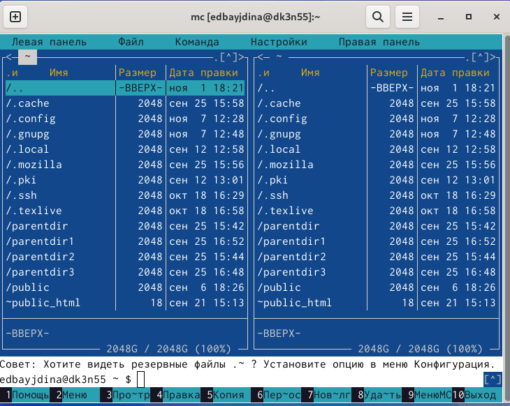{#fig:001 width=70%}

Перехожу в каталог ~/work/study/2023-2024/Архитектура Компьютера/arch-pc, используя файловый менеджер mc (рис.4.2 [-@fig:002]).

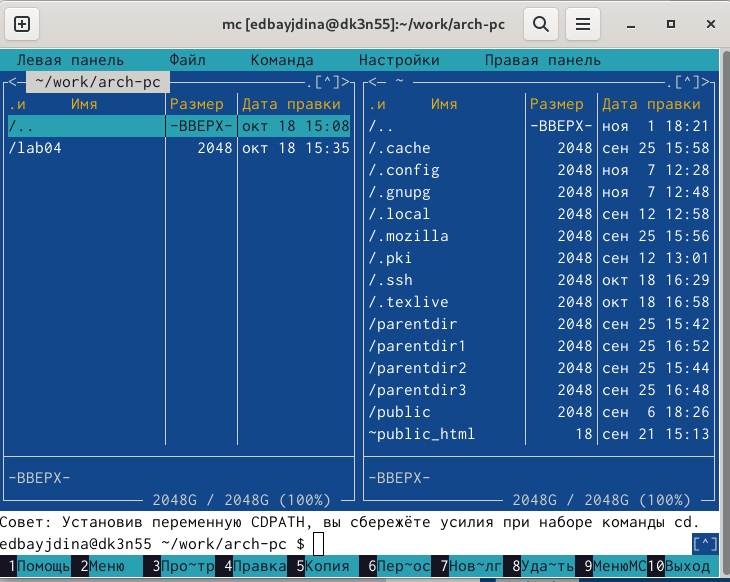{#fig:002 width=70%}

С помощью функциональной клавиши F7 создаю каталог lab05 (рис.4.3 [-@fig:003]).

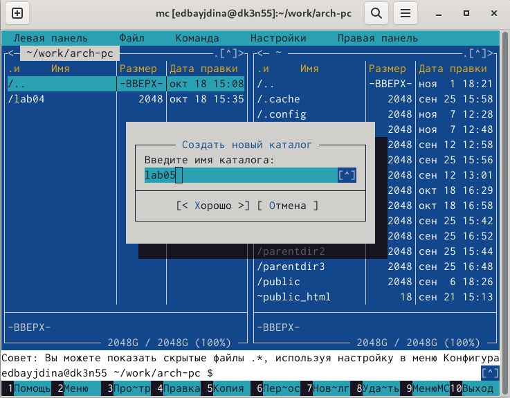{#fig:003 width=70%}

Переходу в созданный каталог (рис.4.4 [-@fig:004]).

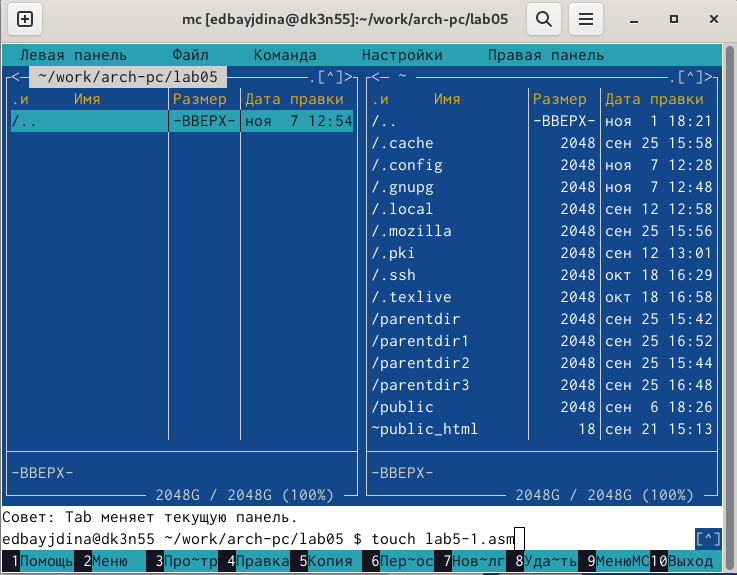{#fig:004 width=70%}

В строке ввода прописываю команду touch lab5-1.asm, чтобы создать файл, в котором буду работать (рис.4.5 [-@fig:005]).

{#fig:005 width=70%}

##Структура программы на языке ассемблера NASM

С помощью функциональной клавиши F4 открываю созданный файл для редактирования в редакторе nano  (рис. 4.6[-@fig:006]).

{#fig:006 width=70%}

Ввожу в файл код программы для запроса строки у пользователя. Далее выхожу из файла (Ctrl+X), сохраняя изменения (Y, Enter).(рис.4.7 [-@fig:007]).

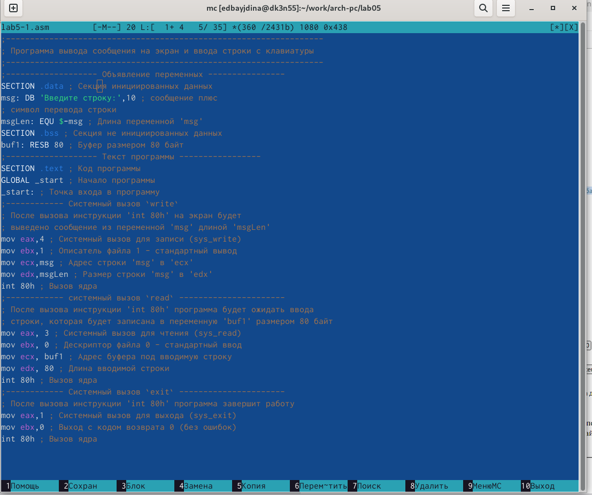{#fig:007 width=70%}

С помощью функциональной клавиши F3 открываю файл для просмотра, чтобы проверить, содержит ли файл текст программы (рис.4.8 [-@fig:008]).

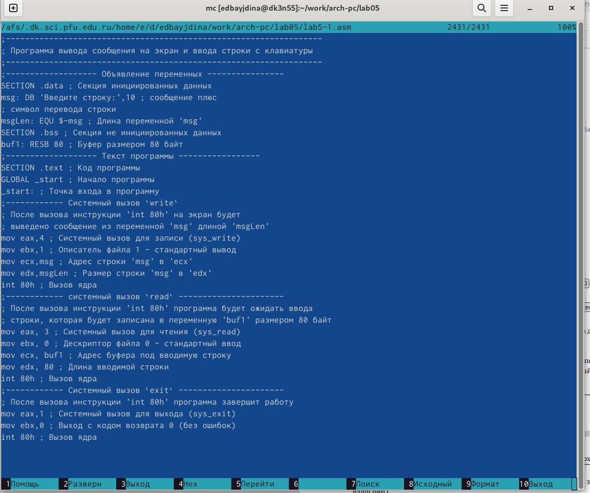{#fig:008 width=70%}

Транслирую текст программы файла в объектный файл командой nasm -f elf lab5-1.asm. Создался объектный файл lab5-1.o. Выполняю компоновку объектного файла с помощью команды ld -m elf_i386 -o lab5-1 lab5-1.o Создался исполняемый файл lab5-1(рис.4.9 [-@fig:009]).

{#fig:009 width=70%}

Запускаю исполняемый файл. Программа выводит строку "Введите строку: " и ждет ввода с клавиатуры, я ввожу свои ФИО, на этом программа заканчивает свою работу (рис.4.10 [-@fig:010]).

{#fig:010 width=70%}

##Подключение внешнего файла

Скачиваю файл in_out.asm со страницы курса в ТУИС. Он сохранился в каталог "Загрузки" (рис. 4.11[-@fig:011]).

{#fig:011 width=70%}

С помощью функциональной клавиши F6 перемещаю файл in_out.asm из каталога Загрузки в созданный каталог lab05.(рис.4.12 [-@fig:012]).

{#fig:012 width=70%}

С помощью функциональной клавиши F5 копирую файл lab5-1 в тот же каталог, но с другим именем, для этого в появившемся окне mc прописываю имя для копии файла  (рис.4.13 [-@fig:013]).

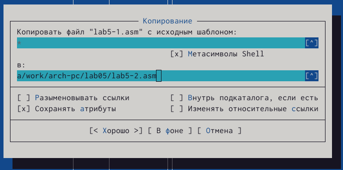{#fig:013 width=70%}

Изменяю содержимое файла lab5-2.asm во встроенном редакторе nano, чтобы в программе использовались подпрограммы из внешнего файла in_out.asm(рис.4.14 [-@fig:014]).

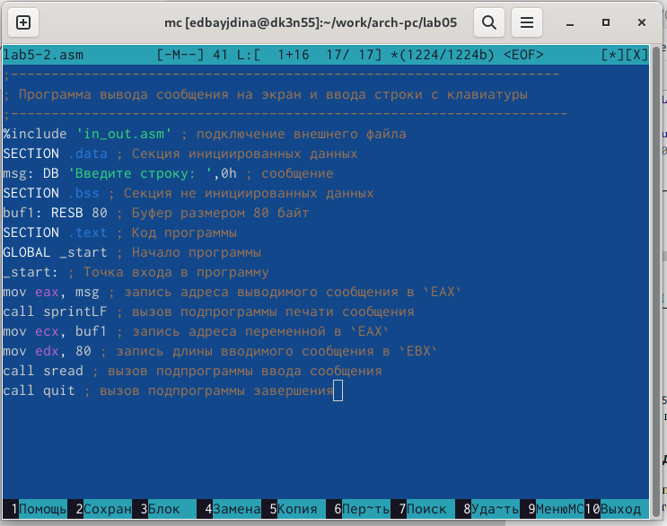{#fig:014 width=70%}

Транслирую текст программы файла в объектный файл командой nasm -f elf lab5-2.asm. Создался объектный файл lab5-2.o. Выполняю компоновку объектного файла с помощью команды ld -m elf_i386 -o lab5-2 lab5-2.o Создался исполняемый файл lab5-2. Запускаю исполняемый файл  (рис.4.15 [-@fig:015]).

{#fig:015 width=70%}

Открываю файл lab5-2.asm для редактирования в nano функциональной клавишей F4. Изменяю в нем подпрограмму sprintLF на sprint. Сохраняю изменения и открываю файл для просмотра, чтобы проверить сохранение действий (рис.4.16 [-@fig:016]).

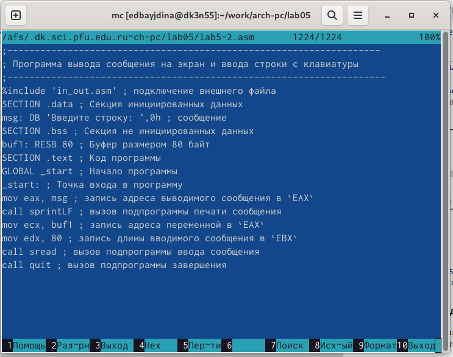{#fig:016 width=70%}

Снова транслирую файл, выполняю компоновку созданного объектного файла, запускаю новый исполняемый файл (рис.4.17 [-@fig:017]).

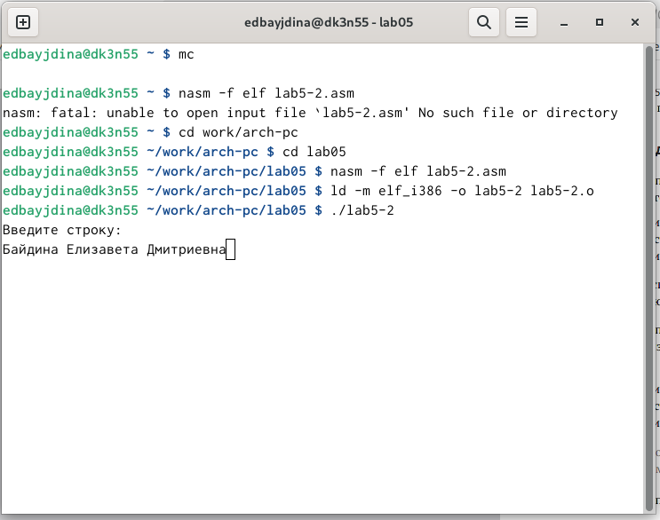{#fig:017 width=70%}

##Выполнение заданий для самостоятельной работы

Создаю копию файла lab5-1.asm с именем lab5-1-1.asm с помощью функциональной клавиши F5 (рис. 4.18[-@fig:018]).

{#fig:018 width=70%}

С помощью функциональной клавиши F4 открываю созданный файл для редактирования. Изменяю программу так, чтобы кроме вывода приглашения и запроса ввода, она выводила вводимую пользователем строку(рис.4.19 [-@fig:019]).

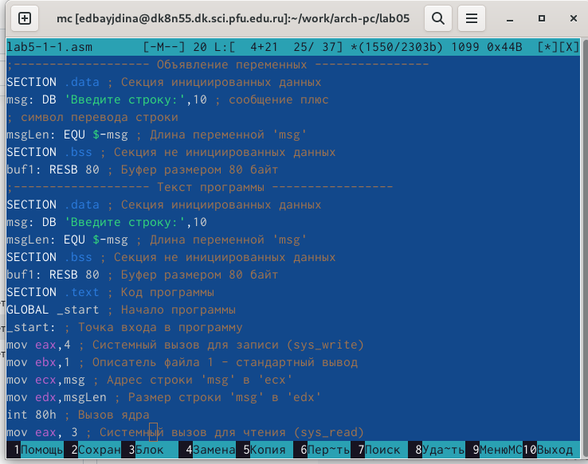{#fig:019 width=70%}

Создаю объектный файл lab5-1-1.o, отдаю его на обработку компоновщику, получаю исполняемый файл lab5-1-1, запускаю полученный исполняемый файл. Программа запрашивает ввод, ввожу свои ФИО, далее программа выводит введенные мною данные (рис.4.20 [-@fig:020]).

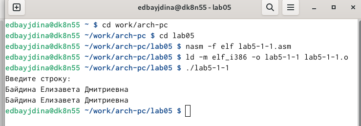{#fig:020 width=70%}

Создаю копию файла lab5-2.asm с именем lab5-2-1.asm с помощью функциональной клавиши F5 (рис.4.21 [-@fig:021]).

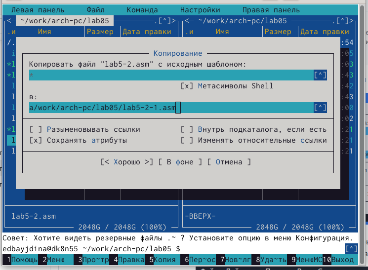{#fig:021 width=70%}

С помощью функциональной клавиши F4 открываю созданный файл для редактирования. Изменяю программу так, чтобы кроме вывода приглашения и запроса ввода, она выводила вводимую пользователем строку(рис.4.22 [-@fig:022]).

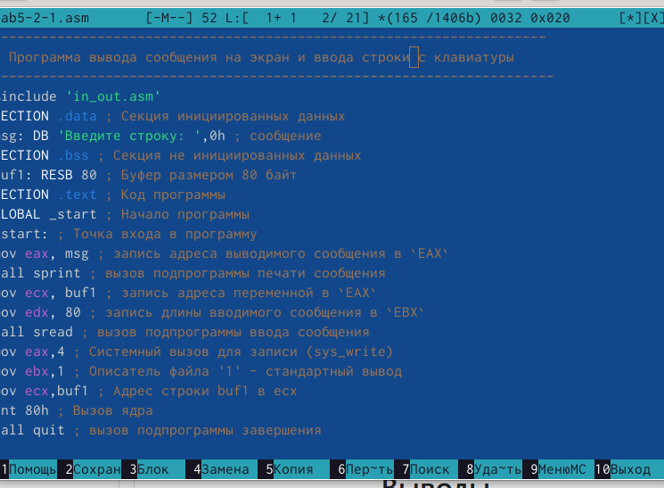{#fig:022 width=70%}

Создаю объектный файл lab5-2-1.o, отдаю его на обработку компоновщику, получаю исполняемый файл lab5-2-1, запускаю полученный исполняемый файл. Программа запрашивает ввод без переноса на новую строку, ввожу свои ФИО, далее программа выводит введенные мною данные (рис.4.23 [-@fig:023]).

{#fig:023 width=70%}

# Выводы

При выполнении данной лабораторной работы я приобрела практические навыки работы в Midnight Commander, а также освоила инструкции языка ассемблера mov и int.
