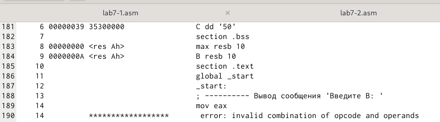
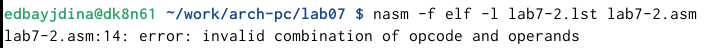
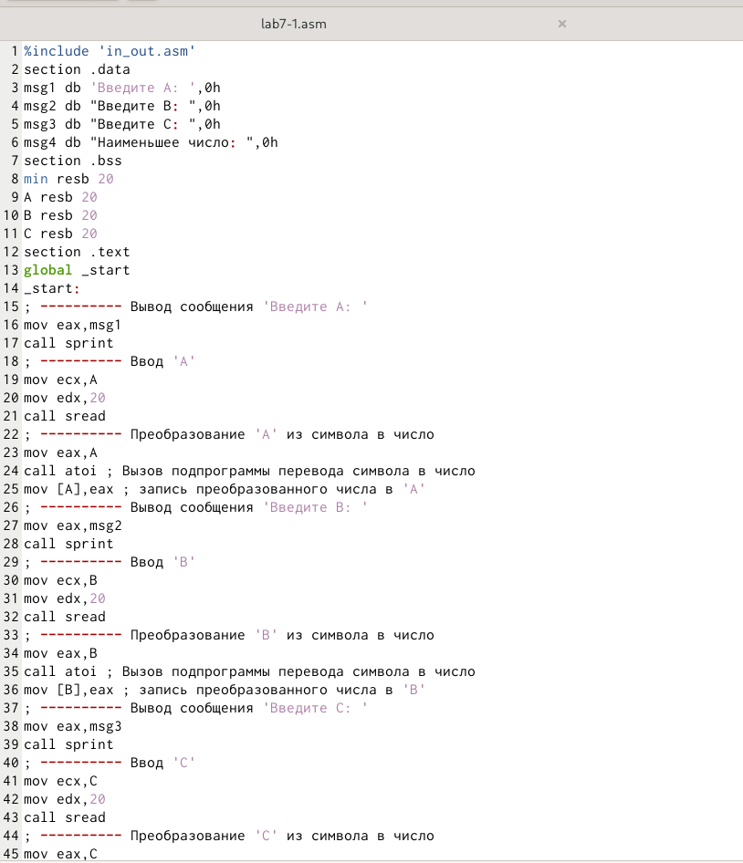
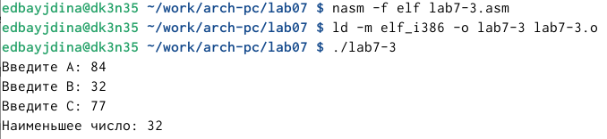
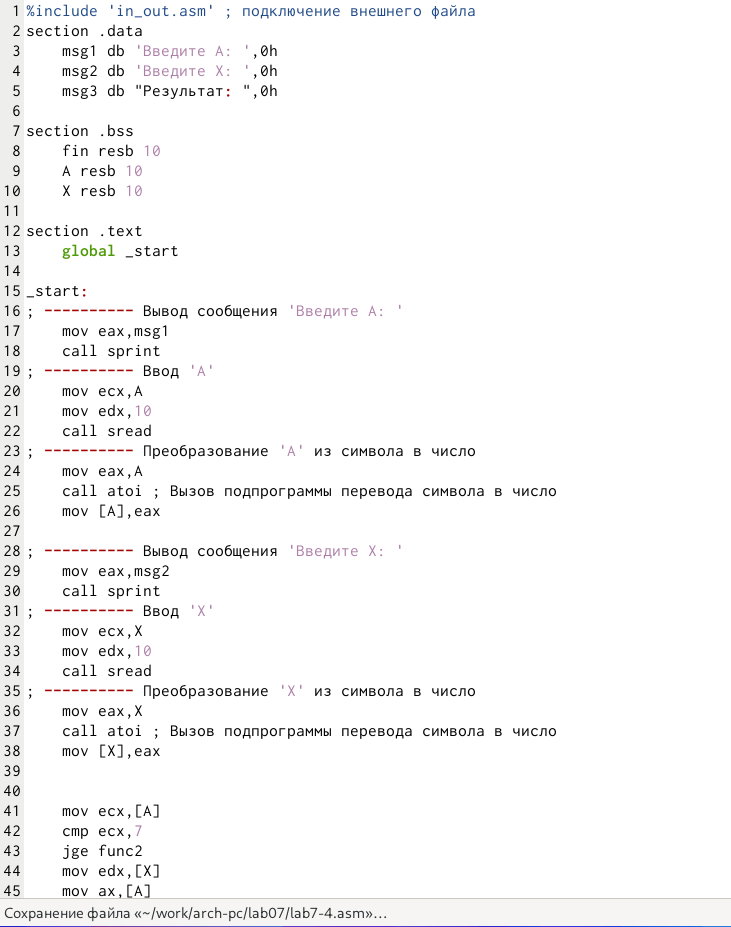
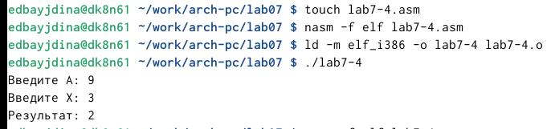

---
## Front matter
title: "Отчет по лабораторной работе №7"
subtitle: "Дисциплина: архитектура компьютера"
author: "Байдина Елизавета Дмитриевна"

## Generic otions
lang: ru-RU
toc-title: "Содержание"

## Bibliography
bibliography: bib/cite.bib
csl: pandoc/csl/gost-r-7-0-5-2008-numeric.csl

## Pdf output format
toc: true # Table of contents
toc-depth: 2
lof: true # List of figures
lot: true # List of tables
fontsize: 12pt
linestretch: 1.5
papersize: a4
documentclass: scrreprt
## I18n polyglossia
polyglossia-lang:
  name: russian
  options:
	- spelling=modern
	- babelshorthands=true
polyglossia-otherlangs:
  name: english
## I18n babel
babel-lang: russian
babel-otherlangs: english
## Fonts
mainfont: IBM Plex Serif
romanfont: IBM Plex Serif
sansfont: IBM Plex Sans
monofont: IBM Plex Mono
mathfont: STIX Two Math
mainfontoptions: Ligatures=Common,Ligatures=TeX,Scale=0.94
romanfontoptions: Ligatures=Common,Ligatures=TeX,Scale=0.94
sansfontoptions: Ligatures=Common,Ligatures=TeX,Scale=MatchLowercase,Scale=0.94
monofontoptions: Scale=MatchLowercase,Scale=0.94,FakeStretch=0.9
mathfontoptions:
## Biblatex
biblatex: true
biblio-style: "gost-numeric"
biblatexoptions:
  - parentracker=true
  - backend=biber
  - hyperref=auto
  - language=auto
  - autolang=other*
  - citestyle=gost-numeric
## Pandoc-crossref LaTeX customization
figureTitle: "Рис."
tableTitle: "Таблица"
listingTitle: "Листинг"
lofTitle: "Список иллюстраций"
lotTitle: "Список таблиц"
lolTitle: "Листинги"
## Misc options
indent: true
header-includes:
  - \usepackage{indentfirst}
  - \usepackage{float} # keep figures where there are in the text
  - \floatplacement{figure}{H} # keep figures where there are in the text
---

# Цель работы

Целью данной лабораторной работы является изучение команд условного и безусловного переходов, приобретение навыков написания программ с использованием переходов,а также знакомство с назначением и структурой файла листинга.

# Задание

1. Реализация переходов в NASM

2. Изучение структуры файлы листинга 

3. Ответы на вопросы

4. Выполнение заданий для самостоятельной работы

# Теоретическое введение

Здесь описываются теоретические аспекты, связанные с выполнением работы.

Например, в табл. [-@tbl:std-dir] приведено краткое описание стандартных каталогов Unix.

: Описание некоторых каталогов файловой системы GNU Linux {#tbl:std-dir}

| Имя каталога | Описание каталога                                                                                                          |
|--------------|----------------------------------------------------------------------------------------------------------------------------|
| `/`          | Корневая директория, содержащая всю файловую                                                                               |
| `/bin `      | Основные системные утилиты, необходимые как в однопользовательском режиме, так и при обычной работе всем пользователям     |
| `/etc`       | Общесистемные конфигурационные файлы и файлы конфигурации установленных программ                                           |
| `/home`      | Содержит домашние директории пользователей, которые, в свою очередь, содержат персональные настройки и данные пользователя |
| `/media`     | Точки монтирования для сменных носителей                                                                                   |
| `/root`      | Домашняя директория пользователя  `root`                                                                                   |
| `/tmp`       | Временные файлы                                                                                                            |
| `/usr`       | Вторичная иерархия для данных пользователя                                                                                 |

Более подробно про Unix см. в [@tanenbaum_book_modern-os_ru; @robbins_book_bash_en; @zarrelli_book_mastering-bash_en; @newham_book_learning-bash_en].

# Выполнение лабораторной работы

## Реализация переходов в NASM

Создаю файл листинга для программы из файла lab7-2.asm и открываю его (рис. [-@fig:012])

{#fig:012 width=70%}

Объяснение строки: В регистр eax мы вносим значение 4 (рис. [-@fig:013])

{#fig:013 width=70%}

Объяснение строки: В регистр eax мы вносим значение 3 (рис. [-@fig:014])

{#fig:014 width=70%}

Объяснение строки: Вызов подпрограммы перевода символа в число (рис. [-@fig:015])

{#fig:015 width=70%}

Удаляю один из операндов (рис. [-@fig:016])

{#fig:016 width=70%}

Выполняю трансляцию с получением файла листинга, но ничего не выводит (рис. [-@fig:017])

{#fig:017 width=70%}

## Выполнение заданий для самостоятельной работы

Создаю файл для задания №1 (рис. [-@fig:018])

{#fig:018 width=70%}

Записываю текст программы для нахождения наименьшего числа (рис. [-@fig:019])

{#fig:019 width=70%}

Создаю исполняемый файл и проверяю правильность работы (рис. [-@fig:020])

{#fig:020 width=70%}

Создаю файл для задания №2 (рис. [-@fig:021])

{#fig:021 width=70%}

Записываю текст программы для вычисления выражения f(x) (рис. [-@fig:022])

{#fig:022 width=70%}

Создаю исполняемый файл, запускаю и убеждаюсь в правильности программы (рис. [-@fig:023])

{#fig:023 width=70%}

# Выводы

Я ознакомилась с командами условного и безусловного переходов,приобрела навыки написаия программ с использованием переходов, а также познакомилась с назначением и структурой файла листинга.

# Список литературы{.unnumbered}

::: {#refs}
:::
