---
## Front matter

title: "Отчёт по лабораторной работе №8"
subtitle: "Дисциплина: архитектура компьютера"
author: "Байдина Елизавета Дмитриевна"

## Generic otions

lang: ru-RU
toc-title: "Содержание"

## Bibliography

bibliography: bib/cite.bib
csl: pandoc/csl/gost-r-7-0-5-2008-numeric.csl

## Pdf output format

toc: true # Table of contents
toc-depth: 2
lof: true # List of figures
lot: true # List of tables
fontsize: 12pt
linestretch: 1.5
papersize: a4
documentclass: scrreprt

## I18n polyglossia

polyglossia-lang:
  name: russian
  options:
	- spelling=modern
	- babelshorthands=true
polyglossia-otherlangs:
  name: english
  
## I18n babel

babel-lang: russian
babel-otherlangs: english

## Fonts

mainfont: IBM Plex Serif
romanfont: IBM Plex Serif
sansfont: IBM Plex Sans
monofont: IBM Plex Mono
mathfont: STIX Two Math
mainfontoptions: Ligatures=Common,Ligatures=TeX,Scale=0.94
romanfontoptions: Ligatures=Common,Ligatures=TeX,Scale=0.94
sansfontoptions: Ligatures=Common,Ligatures=TeX,Scale=MatchLowercase,Scale=0.94
monofontoptions: Scale=MatchLowercase,Scale=0.94,FakeStretch=0.9

mathfontoptions:

## Biblatex

biblatex: true
biblio-style: "gost-numeric"
biblatexoptions:
  - parentracker=true
  - backend=biber
  - hyperref=auto
  - language=auto
  - autolang=other*
  - citestyle=gost-numeric
  
## Pandoc-crossref LaTeX customization
figureTitle: "Рис."
tableTitle: "Таблица"
listingTitle: "Листинг"
lofTitle: "Список иллюстраций"
lotTitle: "Список таблиц"
lolTitle: "Листинги"

## Misc options
indent: true
header-includes:
  - \usepackage{indentfirst}
  - \usepackage{float} # keep figures where there are in the text
  - \floatplacement{figure}{H} # keep figures where there are in the text
---

# Цель работы

Приобрести навыки написания программ с использованием циклов и обработкой аргументов командной строки.

# Задание

1. Реализация циклов в NASM

2. Обработка аргументов командной строки

3. Задание для самостоятельной работы

# Теоретическое введение

Стек — это структура данных, организованная по принципу LIFO («Last In — First Out» или «последним пришёл — первым ушёл»). Стек является частью архитектуры процессора и реализован на аппаратном уровне. Для работы со стеком в процессоре есть специальные регистры (ss, bp, sp) и команды.

Основной функцией стека является функция сохранения адресов возврата и передачи аргументов при вызове процедур. Кроме того, в нём выделяется память для локальных переменных и могут временно храниться значения регистров.

Для организации циклов существуют специальные инструкции. Для всех инструкций максимальное количество проходов задаётся в регистре ecx. Наиболее простой является инструкция loop. Она позволяет организовать безусловный цикл.

Иструкция loop выполняется в два этапа. Сначала из регистра ecx вычитается единица и его значение сравнивается с нулём. Если регистр не равен нулю, то выполняется переход к указанной метке. Иначе переход не выполняется и управление передаётся команде, которая следует сразу после команды loop.

При разработке программ иногда встает необходимость указывать аргументы, которые будут использоваться в программе, непосредственно из командной строки при запуске программы.

При запуске программы в NASM аргументы командной строки загружаются в стек в обратном порядке, кроме того в стек записывается имя программы и общее количество аргументов. Последние два элемента стека для программы, скомпилированной NASM, – это всегда имя программы и количество переданных аргументов.

Таким образом, для того чтобы использовать аргументы в программе, их просто нужно извлечь из стека. Обработку аргументов нужно проводить в цикле. Т.е. сначала нужно извлечь из стека количество аргументов, а затем циклично для каждого аргумента выполнить логику программы. 

# Выполнение лабораторной работы

## Реализация циклов в NASM

Создаю каталог для программам лабораторной работы № 8 (рис. [-@fig:001])

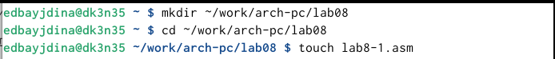{#fig:001 width=70%}

Копирую файл in_out.asm из загрузок в соответствующую папку для дальнейшей работы (рис. [-@fig:002])

{#fig:002 width=70%}

Ввожу в lab8-1.asm текст программы из листинга 8.1 (рис. [-@fig:003])

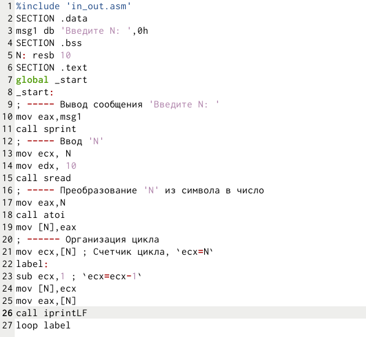{#fig:003 width=70%}

Создаю исполняемый файл и запускаю его (рис. [-@fig:004])

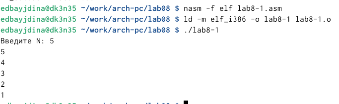{#fig:004 width=70%}

Изменение текста программы из листинга 8.1 (рис. [-@fig:005])

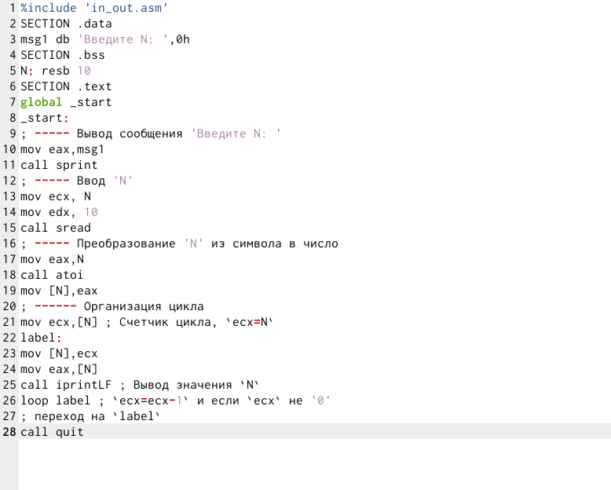{#fig:005 width=70%}

Создаю изменённый исполняемый файл и запускаю его (рис. [-@fig:006])

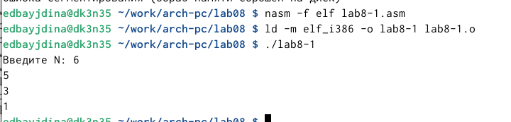{#fig:006 width=70%}

Изменяю текст программы так, чтобы программа работала корректно (рис. [-@fig:007])

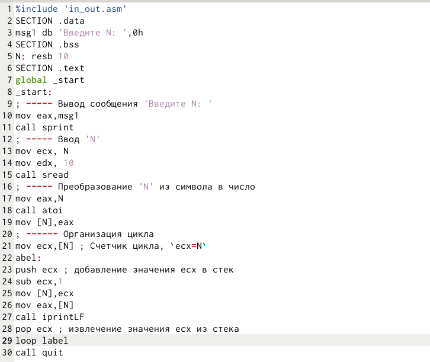{#fig:007 width=70%}

Создаю исполняемый файл и запускаю его (рис. [-@fig:008])

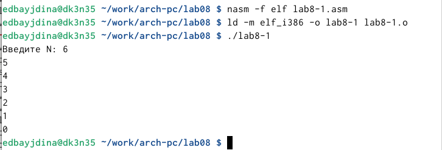{#fig:008 width=70%}

## Обработка аргументов командной строки

Создаю файл lab8-2.asm (рис. [-@fig:009])

{#fig:009 width=70%}

Ввожу текст программы из листинга 8.2 в файл (рис. [-@fig:010])

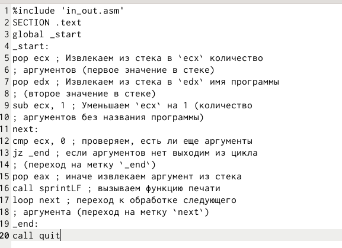{#fig:010 width=70%}

Создаю исполняемый файл и запускаю его  (рис. [-@fig:011])

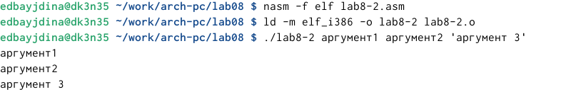{#fig:011 width=70%}

Создаю файл lab8-3.asm(рис. [-@fig:012])

{#fig:012 width=70%}

Ввожу текст программы из листинга 8.3 в файл (рис. [-@fig:013])

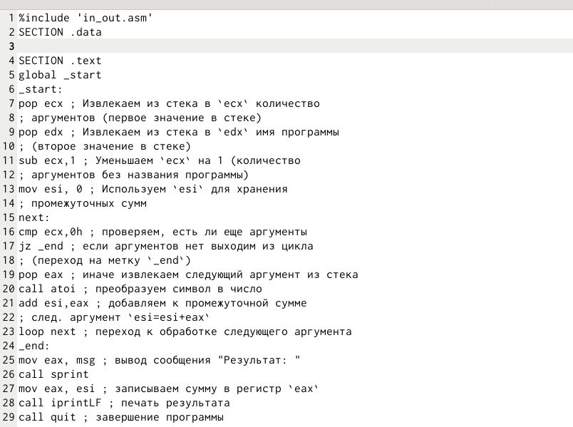{#fig:013 width=70%}

Создаю исполняемый файл и запускаю его.И вывожу сумма аргументов (рис. [-@fig:014])

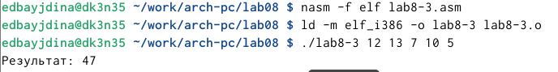{#fig:014 width=70%}

Изменяю текст рограммы так,чтобы она выводла произвдение аргументов (рис. [-@fig:015])

{#fig:015 width=70%}

Создаю исполняемый файл и запускаю его (рис. [-@fig:016])

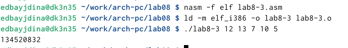{#fig:016 width=70%}

## Задание для самостоятельной работы

Создаю файл, для программы в рамках смостоятельной работы (рис. [-@fig:017])

{#fig:017 width=70%}

Пишу программу для своего тринадцатого варианта (рис. [-@fig:018])

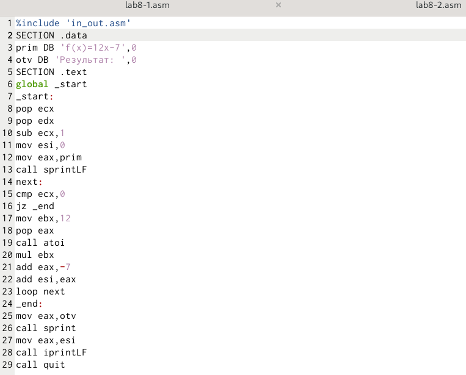{#fig:018 width=70%}

Запускаю исполняемый файл (рис. [-@fig:019])

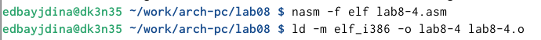{#fig:019 width=70%}

Запускаю исполняемый файл (рис. [-@fig:020])

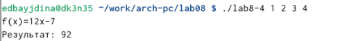{#fig:020 width=70%}

# Выводы

В ходе выполнения данной лабораторной работы были приобретены навыки написания программ с использованием циклов и обработкой аргументов командной строки.
