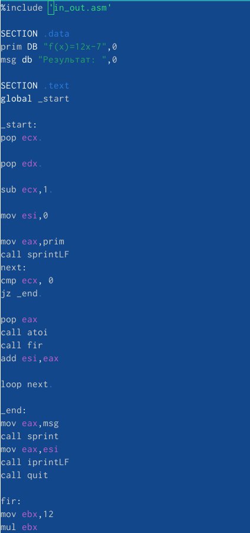
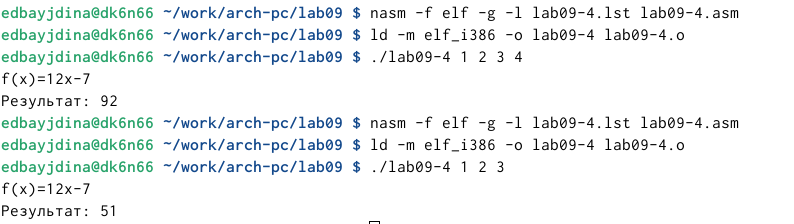
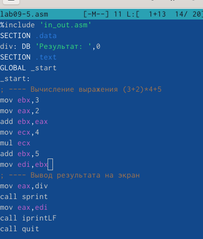

---
## Front matter
title: "Отчет по лабораторной работе №9"
subtitle: "Дисциплина: архитектура компьютера"
author: "Байдина Елизавета Дмитриевна"

## Generic otions
lang: ru-RU
toc-title: "Содержание"

## Bibliography
bibliography: bib/cite.bib
csl: pandoc/csl/gost-r-7-0-5-2008-numeric.csl

## Pdf output format
toc: true # Table of contents
toc-depth: 2
lof: true # List of figures
lot: true # List of tables
fontsize: 12pt
linestretch: 1.5
papersize: a4
documentclass: scrreprt
## I18n polyglossia
polyglossia-lang:
  name: russian
  options:
	- spelling=modern
	- babelshorthands=true
polyglossia-otherlangs:
  name: english
## I18n babel
babel-lang: russian
babel-otherlangs: english
## Fonts
mainfont: PT Serif
romanfont: PT Serif
sansfont: PT Sans
monofont: PT Mono
mainfontoptions: Ligatures=TeX
romanfontoptions: Ligatures=TeX
sansfontoptions: Ligatures=TeX,Scale=MatchLowercase
monofontoptions: Scale=MatchLowercase,Scale=0.9
## Biblatex
biblatex: false
biblio-style: "gost-numeric"
biblatexoptions:
  - parentracker=true
  - backend=biber
  - hyperref=auto
  - language=auto
  - autolang=other*
  - citestyle=gost-numeric
## Pandoc-crossref LaTeX customization
figureTitle: "Рис."
tableTitle: "Таблица"
listingTitle: "Листинг"
lofTitle: "Список иллюстраций"
lotTitle: "Список таблиц"
lolTitle: "Листинги"
## Misc options
indent: true
header-includes:
  - \usepackage{indentfirst}
  - \usepackage{float} # keep figures where there are in the text
  - \floatplacement{figure}{H} # keep figures where there are in the text
---

# Цель работы

Приобретение навыков написания программ с использованием подпрограмм.Знакомство с методами отладки при помощи GDB и его основными возможностями

# Задание

1. Реализация программы

2. Отладка программ

3. Добавление точек останова

4. Работа с данными программы в GDB

5. Обработка аргументов командной строки в GDB 

6. Выполнение самостоятельной работ

# Выполнение лабораторной работы

## Реализация программы

Согласно заданию создаю каталог lab09-1.asm

{ #fig:001 width=70% }

 Ввожу программу из листинга 9.1

{ #fig:002 width=70% }

Запускаю программу

{ #fig:003 width=70% }

## Отладка программ

Создаю программу и ввожу текст программы

{ #fig:004 width=70% }

Загружаю исполняемый файл в отладчик gbd и для более подробного анализа программы установливаю брейкпоинт на метку _start, с которой начинается выполнение любой ассемблерной программы, и запускаю её.

{ #fig:005 width=70% }

{ #fig:006 width=70% }

{ #fig:007 width=70% }

Посматриваю дисассимилированный код программы с помощью команды disassemble начиная с метки _start.

{ #fig:008 width=70% }

Переключаюсь на отображение команд с Intel’овским синтаксисом, введя команду set disassembly-flavor intel

{ #fig:009 width=70% }

Включаю режим псевдографики для более удобного анализа программы 

{ #fig:010 width=70% }

## Добавление точек останова

На предыдущих шагах была установлена точка останова по имени метки (_start). Проверяю это с помощью команды info breakpoints (кратко i b):

{ #fig:011 width=70% }

Определяю адрес предпоследней инструкции (mov ebx,0x0) и устанавливаю точку останова.

{ #fig:012 width=70% }

Посмотриваю информацию о всех установленных точках останова

{ #fig:013 width=70% }

## Работа с данными программы в GDB

Просматриваю значение переменной msg1 и меняю первый символ переменной msg1 

{ #fig:014 width=70% }

С помощью команды set меняю значение регистра ebx

{ #fig:015 width=70% }

{ #fig:016 width=70% }

## Обработка аргументов командной строки в GDB

Копирую файл согласно заданию

{ #fig:017 width=70% }

Создаю исполняемый файл и запускаю его

{ #fig:018 width=70% }

{ #fig:019 width=70% }

Для начала установлю точку останова перед первой инструкцией в программе и запущу её.

{ #fig:020 width=70% }

Адрес вершины стека храниться в регистре esp и по этому адресу располагается число равное количеству аргументов командной строки (включая имя программы)

{ #fig:021 width=70% }

Посматриваю остальные позиции стека – по адесу [esp+4] располагается адрес в памяти,где находиться имя программы, по адесу [esp+8] храниться адрес первого аргумента, по аресу [esp+12] – второго и т.д.

{ #fig:022 width=70% }

Я посмотрела все позиции стека. По первому адрему хранится адрес, в остальных адресах хранятся элементы. Элементы расположены с интервалом в 4 единицы, так как стек может хранить до 4 байт, и для того чтобы данные сохранялись нормально и без помех, компьютер использует новый стек для новой информации.

## Выполнение самостоятельной работы

Я преобразовала программу из лабораторной работы №8 и реализовала вычисления как подпрограмму.

{ #fig:023 width=70% }

{ #fig:024 width=70% }

Я переписала программу и попробовала запустить ее чтобы увидеть ошибку. Ошибка была арифметическая.

{ #fig:025 width=70% }

{ #fig:026 width=70% }

После появления ошибки, я запустила программу в отладчике.

{ #fig:027 width=70% }

Я открыла регистры и проанализировала их, поняла что некоторые регистры стоят не на своих местах и исправил это.

{ #fig:028 width=70% }

# Вывод{.unnumbered}

Я приобрела навыки написания программ использованием подпрограмм. Познакомилась с методами отладки при помозь GDB и его основными возможностями.

