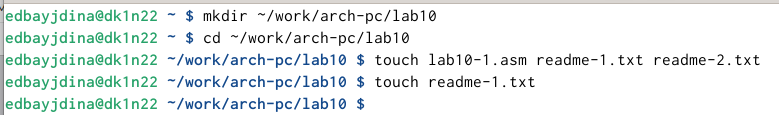
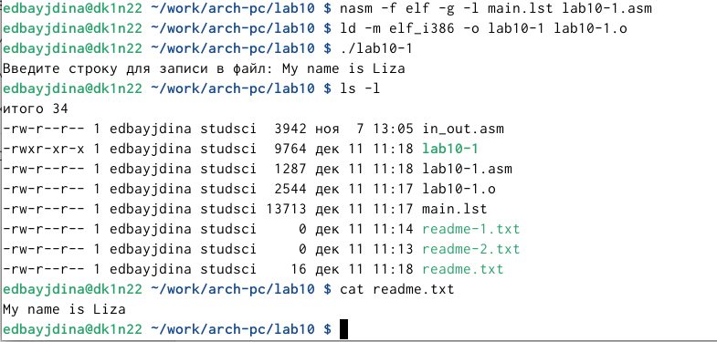
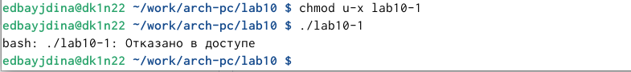
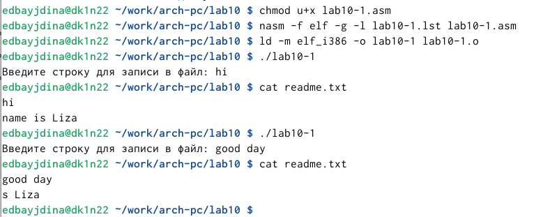
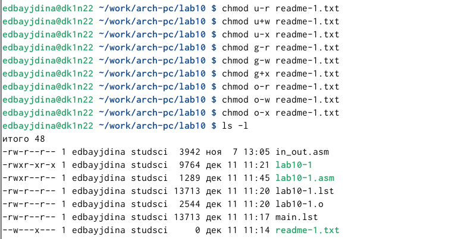
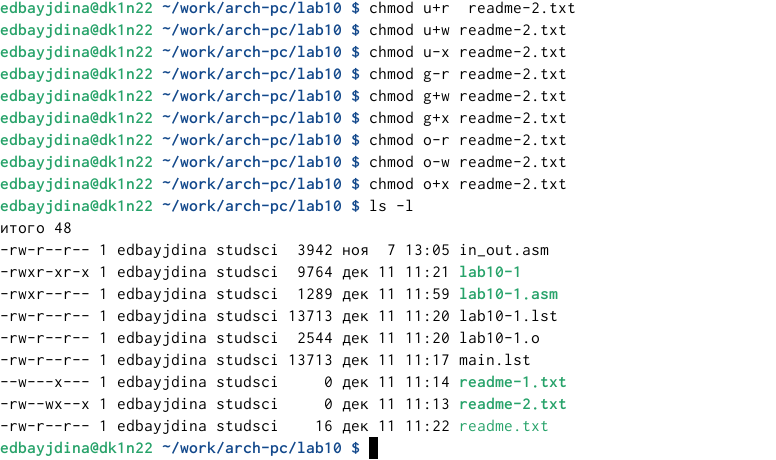
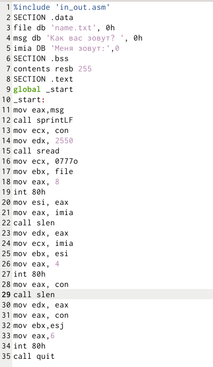
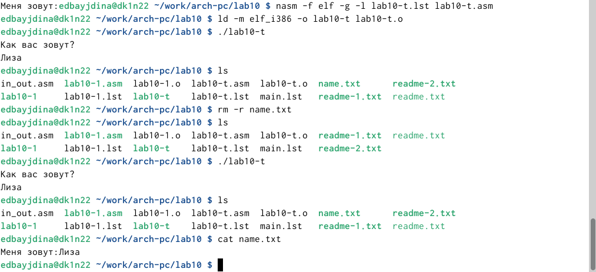

---
## Front matter
title: "Отчет по лабораторной работе №10"
subtitle: "Дисциплина: архитектура компьютера"
author: "Байдина Елизавета Дмитриевна"

## Generic otions
lang: ru-RU
toc-title: "Содержание"

## Bibliography
bibliography: bib/cite.bib
csl: pandoc/csl/gost-r-7-0-5-2008-numeric.csl

## Pdf output format
toc: true # Table of contents
toc-depth: 2
lof: true # List of figures
lot: true # List of tables
fontsize: 12pt
linestretch: 1.5
papersize: a4
documentclass: scrreprt
## I18n polyglossia
polyglossia-lang:
  name: russian
  options:
	- spelling=modern
	- babelshorthands=true
polyglossia-otherlangs:
  name: english
## I18n babel
babel-lang: russian
babel-otherlangs: english
## Fonts
mainfont: PT Serif
romanfont: PT Serif
sansfont: PT Sans
monofont: PT Mono
mainfontoptions: Ligatures=TeX
romanfontoptions: Ligatures=TeX
sansfontoptions: Ligatures=TeX,Scale=MatchLowercase
monofontoptions: Scale=MatchLowercase,Scale=0.9
## Biblatex
biblatex: false
biblio-style: "gost-numeric"
biblatexoptions:
  - parentracker=true
  - backend=biber
  - hyperref=auto
  - language=auto
  - autolang=other*
  - citestyle=gost-numeric
## Pandoc-crossref LaTeX customization
figureTitle: "Рис."
tableTitle: "Таблица"
listingTitle: "Листинг"
lofTitle: "Список иллюстраций"
lotTitle: "Список таблиц"
lolTitle: "Листинги"
## Misc options
indent: true
header-includes:
  - \usepackage{indentfirst}
  - \usepackage{float} # keep figures where there are in the text
  - \floatplacement{figure}{H} # keep figures where there are in the text
---

# Цель работы

Приобретение навыков написания программ для работы с файлами

# Задание

1. Лабораторная работа

2. Выполнение самостоятельной работы

# Выполнение лабораторной работы

## Лабораторная работа

Я создала каталог lab10 и в нем файл lab10.asm

{ #fig:001 width=70% }

Я ввела в файл текст программы и запустила ее. Ответ сохранился в файле readme.txt.

{ #fig:002 width=70% }

{ #fig:003 width=70% }

С помощью команды сhmod я запретила выполнять программу. Выдало отказ в доступе, как и следовало ожидать, так как я просто запретила запускать программу для владельца, то есть для себя.

{ #fig:004 width=70% }

С помощью команды я дала разрешение на исполнение файлу с исходным текстом и перекомпелировала программу, она заработала, так как файл был со всеми разрешениями и до этого я запретила выполняться уже готовой программе, а это фактически новая программа которая обладает другими разрешениями, поэтому они и запустилась.

{ #fig:005 width=70% }

Я предоставила определенные права файлу readme-1.txt в соответствие с вариантом 13.

{ #fig:006 width=70% }

Я предоставил определенные права файлу readme-2.txt в соответствие с вариантом 13.

{ #fig:007 width=70% }

## Выполнение самостоятельной работы

Я написал программу, которая запрашивает имя и выводит его в созданном файле. Файл создает сама программа.

{ #fig:008 width=70% }

{ #fig:009 width=70% }

# Выводы

Я приобрела навыки написания программ для работы с файлами.

